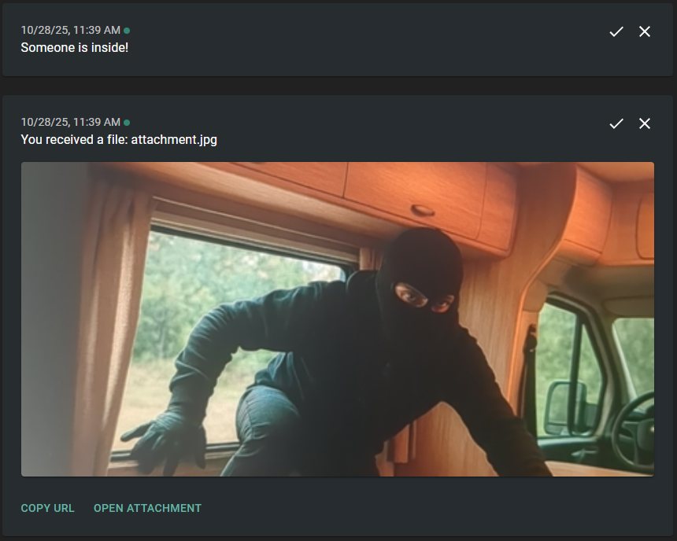

# Van Guardian Sentinel
An Android application that identifies people and sends alerts with photos.



## How it works
1. It runs a foreground service that continuously captures camera photos.
2. Those photos are processed with a ML model (EfficientDet) to identify objects.
3. When a `person` is found with enough confidence, the app sends a push to a `ntfy.sh` server with a recent photo and info about recognized objects.

## Quick server setup (Ntfy.sh)
[Ntfy.sh](https://ntfy.sh/) is a [FOSS](https://github.com/binwiederhier/ntfy) HTTP-based push notification server. You can use the public service for free or [host your own server](https://docs.ntfy.sh/install/).

1. Register at the ntfy.sh [web client](https://ntfy.sh/app).
2. Subscribe to a randomly generated topic.
3. Place the generated topic URL in a `secrets.properties` file at the root of the project like this:
```
NTFY_URL=https://ntfy.sh/topic-name
```

## Limitations
Due to how HTTP-based push servers work, the app sends two separate pushes: one with text and another with the image data. You'll see two separate messages in the web client.
